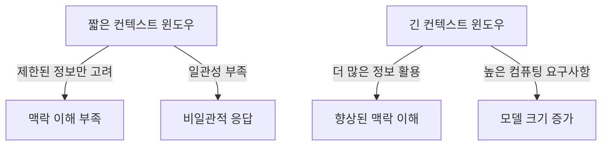

import { Callout, Steps, Step } from "nextra-theme-docs";

# 컨텍스트 윈도우(Context Window)

컨텍스트 윈도우는 LLM(대규모 언어 모델)이 한 번에 고려할 수 있는 문맥의 길이를 의미합니다. 모델의 메모리 제약으로 인해, 긴 문서를 처리할 때는 일부분씩 나누어 처리해야 합니다. 이는 LLM의 성능과 응용 분야에 영향을 미칩니다.

<Callout emoji="💡">
컨텍스트 윈도우는 LLM이 한 번에 고려할 수 있는 입력 길이의 제한을 뜻합니다. 이는 모델의 메모리 용량과 관련이 있습니다.
</Callout>

## 컨텍스트 윈도우의 중요성

LLM의 컨텍스트 윈도우가 작을수록, 긴 문서나 대화에서 제한된 부분만 고려하게 됩니다. 이는 문맥 이해 능력을 저해하고, 일관성 있는 응답을 내기 어렵게 합니다.

반대로 컨텍스트 윈도우가 클수록, 더 많은 정보를 활용할 수 있어 맥락을 파악하기 쉽습니다. 하지만 모델의 크기와 컴퓨팅 요구사항도 증가하게 됩니다.

LLM 개발에서는 컨텍스트 윈도우 크기와 모델 용량 간의 절충점을 찾는 것이 중요합니다.

## 기존 모델과의 차이

전통적인 언어 모델은 일반적으로 문장 또는 짧은 문단 수준의 입력만 처리할 수 있었습니다. 따라서 긴 문서를 처리할 때는 전체 맥락을 이해하기 어려웠습니다.

반면 LLM은 수천 단어 길이의 컨텍스트 윈도우를 가지고 있어, 문단을 넘어 전체 문서의 맥락을 파악할 수 있습니다. 이를 통해 보다 일관되고 적절한 응답을 생성할 수 있습니다.

<Callout emoji="⚠️">
LLM은 긴 컨텍스트 윈도우를 가지지만, 여전히 제한이 있습니다. 문서가 너무 길면 여러 부분으로 나누어 처리해야 합니다.
</Callout>

## 응용 분야와 한계

긴 컨텍스트 윈도우는 다음과 같은 응용 분야에서 유용합니다:

- 질문 응답 시스템: 긴 문서에서 관련 정보를 찾아 답변을 생성할 수 있습니다.
- 요약: 전체 문서의 맥락을 파악하여 중요한 내용을 요약할 수 있습니다.
- 대화 시스템: 긴 대화 이력을 고려하여 일관된 응답을 생성할 수 있습니다.

하지만 컨텍스트 윈도우는 모델의 메모리 제약으로 인해 여전히 한계가 있습니다. 매우 긴 문서의 경우, [RAG(Retrieval Augmented Generation)](/what-is-rag)와 같은 기술을 사용하여 외부 데이터베이스의 정보를 활용할 수 있습니다.

<Steps>

### 1단계: 입력 텍스트 분할

긴 문서를 컨텍스트 윈도우 크기에 맞게 여러 조각으로 나눕니다.

### 2단계: 각 조각에 대해 LLM 실행

나누어진 각 조각에 대해 LLM을 실행하여 결과를 얻습니다.

### 3단계: 결과 통합

각 조각에 대한 LLM 결과를 통합하여 전체 문서에 대한 응답을 생성합니다.

</Steps>

이와 같은 방식으로 LLM은 긴 문서를 처리할 수 있게 됩니다. 하지만 여전히 전체 맥락을 완벽하게 파악하기는 어렵습니다.

## 컨텍스트 윈도우 개선 방향

LLM의 컨텍스트 윈도우 크기를 늘리기 위한 지속적인 연구가 진행되고 있습니다. 이를 통해 더 긴 문서와 대화를 처리할 수 있게 되고, 응답의 일관성과 정확성도 향상될 것입니다.

또한 $k$-mer 등의 기술을 사용하여 문서 조각 간의 중첩을 늘리고, 전체 맥락을 더 잘 파악할 수 있도록 하는 연구도 진행 중입니다.

LLM의 컨텍스트 윈도우 크기 확장과 더불어, 컴퓨팅 자원 활용의 효율성 개선도 중요한 과제입니다. 이를 통해 보다 큰 모델을 적은 자원으로 실행할 수 있게 될 것입니다.