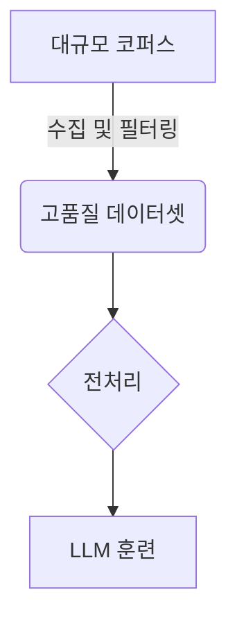

import { Callout, Steps, Step } from "nextra-theme-docs";

# LLM 훈련 및 배포 과제

대규모 언어 모델(LLM)을 성공적으로 훈련하고 배포하기 위해서는 여러 가지 과제와 고려사항이 있습니다. 이 섹션에서는 주요 과제들과 해결 방안에 대해 논의하겠습니다.

## 컴퓨팅 자원 요구사항

<Callout emoji="⚠️">
LLM은 엄청난 양의 데이터와 계산 자원을 필요로 하므로, 모델 훈련 및 배포를 위한 강력한 하드웨어 인프라가 필수적입니다.
</Callout>

LLM은 일반적으로 수십억 개의 매개변수를 가지고 있어, 이를 효과적으로 훈련시키기 위해서는 많은 GPU와 RAM이 필요합니다. 예를 들어 GPT-3는 약 1750억 개의 매개변수를 가지고 있으며, 이를 훈련시키는 데 수천 개의 GPU가 사용되었습니다.

<Steps>
### 1단계: 하드웨어 요구사항 평가
먼저 모델의 크기와 복잡성에 따라 필요한 하드웨어 리소스를 평가해야 합니다. GPU, RAM, 스토리지 등의 요구사항을 결정하고, 이를 충족시킬 수 있는 클라우드 또는 온프레미스 인프라를 준비합니다.

### 2단계: 분산 및 병렬 컴퓨팅
대규모 LLM을 훈련하기 위해서는 일반적으로 여러 GPU를 병렬로 사용하는 분산 컴퓨팅 기술이 필요합니다. 데이터와 모델 매개변수를 효율적으로 분산시키고 관리할 수 있는 프레임워크와 도구를 활용해야 합니다.
</Steps>

## 대규모 데이터 처리

LLM은 일반적으로 수십억 또는 수조 개의 토큰으로 구성된 대규모 텍스트 코퍼스에서 훈련됩니다. 이렇게 방대한 데이터를 효과적으로 처리하고 고품질의 데이터셋을 구축하는 것은 매우 중요한 과제입니다.

<Steps>
### 1단계: 데이터 수집 및 필터링
관련성이 높고 다양한 데이터 소스에서 텍스트 데이터를 수집하고, 품질 기준에 따라 필터링하여 원시 데이터셋을 구축합니다.

### 2단계: 데이터 전처리
원시 데이터셋에 대해 토큰화, 정제, 중복 제거, 포맷 변환 등의 전처리 작업을 수행하여 모델 훈련에 적합한 형태로 가공합니다.

### 3단계: 데이터 셔플링 및 분할
훈련, 검증, 테스트 세트로 데이터를 분할하고, 적절한 셔플링을 수행하여 모델이 일반화된 성능을 발휘할 수 있도록 합니다.
</Steps>

## 모델 최적화

LLM은 크기가 매우 크기 때문에 모델 최적화가 필수적입니다. 효율적인 모델 최적화를 통해 추론 속도를 높이고 리소스 사용량을 줄일 수 있습니다.

- 모델 압축 기법 (pruning, quantization, distillation 등)
- 효율적인 모델 아키텍처 설계
- 병렬 및 분산 컴퓨팅 활용
- 하드웨어 가속 (GPU, TPU 등)

최적화 기법을 적절히 활용하면 모델의 성능을 유지하면서도 상당한 리소스 절감 효과를 얻을 수 있습니다.

## 공정성과 책임성

<Callout emoji="✅">
LLM은 훈련 데이터의 편향성을 내재화할 수 있으므로, 공정성과 책임성 있는 모델 개발을 위한 주의가 필요합니다.
</Callout>

LLM은 훈련 데이터에 존재하는 편향성을 학습하게 되므로, 이를 완화하기 위한 노력이 필요합니다. 데이터 수집 및 전처리 단계에서 편향성을 최소화하고, 모델 훈련 및 평가 과정에서 공정성을 모니터링하고 검증해야 합니다.

또한 LLM의 출력이 해로운 내용을 포함하지 않도록 하고, 모델의 예측 가능성과 설명 가능성을 높이는 것도 중요합니다. 이를 위해 출력 필터링, 모델 투명성 제고, 모델 및 출력에 대한 분석 등의 조치가 필요합니다.

이처럼 LLM 개발 전반에 걸쳐 공정성과 책임성을 고려하는 것이 중요합니다. 이는 LLM의 성공적인 배포와 신뢰성 확보를 위해 필수적인 요소입니다.

이 섹션에서는 LLM 훈련 및 배포의 주요 과제와 해결 방안에 대해 논의했습니다. 다음 섹션인 [컨텍스트 윈도우](/context-window)에서는 LLM의 문맥 이해 능력과 관련된 컨텍스트 윈도우 개념에 대해 다루겠습니다.