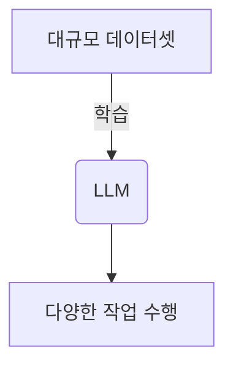

import { Callout, Steps, Step } from "nextra-theme-docs";

# LLM의 장단점

대규모 언어 모델(LLM)은 자연어 처리 분야에서 획기적인 성과를 보이고 있지만, 동전의 양면과 같이 장단점이 공존합니다. 이 섹션에서는 LLM의 잠재적 이점과 한계에 대해 논의하겠습니다.

## 장점

### 일반 지능 기능

<Callout emoji="✨">
LLM은 광범위한 작업에 적용할 수 있는 일반 지능(general intelligence) 기능을 가지고 있습니다. 이는 LLM이 특정 과제에 국한되지 않고 다양한 영역에서 활용될 수 있음을 의미합니다.
</Callout>

과거의 언어 모델은 특정 과제(예: 기계 번역, 질의 응답 등)에 특화되었지만, LLM은 훨씬 더 광범위한 영역에서 사용될 수 있습니다. 이를 통해 LLM은 다양한 애플리케이션에서 인간과 더 자연스러운 상호작용이 가능해졌습니다.

### 대규모 데이터 처리 능력

LLM은 수십억 단어 이상의 대규모 데이터셋으로 학습되었기 때문에 매우 풍부한 지식과 컨텍스트 이해 능력을 가지고 있습니다. 이를 통해 LLM은 복잡한 자연어 작업을 수행할 수 있습니다.

## 단점

### 비용 및 컴퓨팅 자원

LLM을 훈련하고 배포하는 데 막대한 비용과 컴퓨팅 자원이 필요합니다. 대규모 데이터셋과 모델 크기로 인해 LLM은 고성능 GPU 클러스터와 엄청난 전력 소비가 필요합니다. 이는 LLM 활용의 장벽이 될 수 있습니다.

### 편향 위험

<Callout emoji="⚠️">
LLM은 학습 데이터의 편향을 반영할 수 있습니다. 이는 부적절하거나 차별적인 출력을 초래할 수 있습니다. 따라서 LLM 개발 시 공정성과 책임성 문제에 주의를 기울여야 합니다.
</Callout>

LLM이 다양한 온라인 데이터로 학습되면서 그 데이터에 내재된 편향을 반영할 수 있습니다. 이러한 편향은 LLM의 출력에 부적절하거나 차별적인 내용이 포함될 위험을 높입니다. 따라서 LLM 개발 시 이러한 문제를 방지하기 위한 노력이 필요합니다.

### 해석 가능성 부족

LLM은 일종의 블랙박스와 같아서 출력 결과에 대한 해석 가능성이 부족합니다. 즉, LLM이 특정 출력을 도출한 이유나 과정을 명확히 설명하기 어렵습니다. 이는 LLM의 신뢰성과 투명성 측면에서 한계로 지적되고 있습니다.

LLM은 놀랄 만한 성과를 보이고 있지만, 여전히 해결해야 할 과제가 남아 있습니다. LLM의 장단점을 균형 있게 고려하여 책임감 있게 발전시켜 나가는 것이 중요합니다.

관련 섹션:
- [LLM이란?](/what-is-llm)
- [LLM 응용 사례](/llm-use-cases)
- [LLM 훈련 및 배포 과제](/llm-training-deployment-challenges)