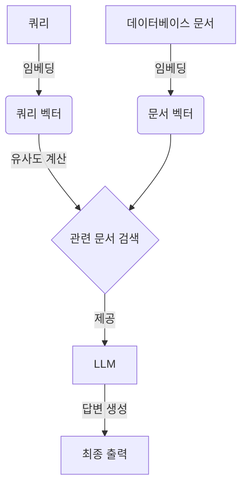

import { Callout, Steps, Step } from "nextra-theme-docs";

# 임베딩(Embedding)의 역할

**임베딩(Embedding)**은 자연어를 숫자로 표현하는 기술입니다. 자연어 처리 모델은 텍스트 데이터를 벡터 공간에 매핑하여 문장이나 단어의 의미를 수치로 표현합니다. 이렇게 하면 컴퓨터가 텍스트 데이터를 더 잘 처리할 수 있습니다.

임베딩은 대규모 언어 모델(LLM)과 RAG(Retrieval Augmented Generation)에서 중요한 역할을 합니다.

<Callout emoji="💡">
임베딩은 텍스트 데이터를 숫자 벡터로 변환하여 컴퓨터가 처리하기 쉽게 만듭니다. 이렇게 하면 LLM과 RAG 모델이 자연어를 더 효과적으로 다룰 수 있습니다.
</Callout>

## LLM에서의 역할

LLM은 거대한 양의 텍스트 데이터로 훈련됩니다. 이때 텍스트 데이터는 임베딩을 통해 숫자 벡터로 변환되어 모델에 입력됩니다. 이렇게 하면 LLM이 단어와 문장의 의미를 보다 잘 포착할 수 있습니다.

또한, 임베딩을 사용하면 모델이 유사한 의미를 가진 단어나 문장을 인식하는 데 도움이 됩니다. 벡터 공간에서 가까운 위치에 있는 단어나 문장일수록 의미가 비슷하기 때문입니다.

## RAG에서의 역할

RAG는 LLM의 지식 생성 능력과 외부 데이터베이스의 정보를 결합합니다. 이때 임베딩은 쿼리와 데이터베이스 문서 간의 관련성을 측정하는 데 사용됩니다.

<Steps>

### 1단계

외부 데이터베이스의 모든 문서는 임베딩을 통해 벡터로 표현됩니다.

### 2단계 

사용자가 입력한 쿼리 또한 임베딩되어 벡터로 변환됩니다.

### 3단계

쿼리 벡터와 문서 벡터 사이의 거리(유사도)를 계산하여 관련 문서를 찾습니다.

### 4단계 

관련 문서는 LLM에 제공되어 쿼리에 대한 답변을 생성하는 데 활용됩니다.

</Steps>

이처럼 임베딩은 LLM과 RAG에서 모두 중요한 역할을 합니다. [LLM이란?](/what-is-llm)과 [RAG(Retrieval Augmented Generation)란?](/what-is-rag)에서 자세한 내용을 확인할 수 있습니다.

<Callout emoji="✏️">
위 다이어그램은 RAG에서 임베딩이 쿼리와 문서 간 관련성 계산에 어떻게 사용되는지 보여줍니다. 임베딩을 통해 텍스트를 벡터로 표현한 뒤, 벡터 간 거리를 계산하여 관련 문서를 찾습니다. 이 정보는 LLM에 제공되어 최종 답변 생성에 활용됩니다.
</Callout>

요약하자면, 임베딩은 LLM과 RAG가 자연어를 보다 효과적으로 처리할 수 있게 해주는 핵심 기술입니다. 텍스트 데이터를 숫자로 표현함으로써 모델의 성능을 높이고 정보 검색 및 활용 능력을 향상시킵니다.