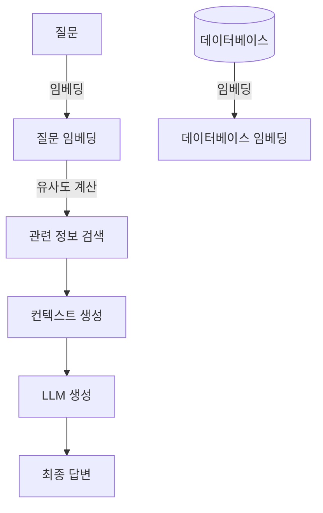

import { Callout, Steps, Step } from "nextra-theme-docs";

# RAG(Retrieval Augmented Generation)란?

RAG(Retrieval Augmented Generation)는 대규모 언어 모델(LLM)의 성능을 더욱 향상시키기 위한 접근 방식입니다. LLM은 광범위한 데이터로 학습하여 일반적인 지식을 갖추지만, 특정 도메인이나 최신 정보에 대해서는 부족할 수 있습니다. RAG는 이러한 한계를 극복하기 위해 외부 데이터베이스나 지식원을 활용합니다.

<Callout>
**예시:** 사용자가 "2022년 월드컵 결과는 어떻게 되었나요?"라고 질문한다면, LLM 단독으로는 정확한 대답을 하기 어렵습니다. 하지만 RAG를 사용하면 관련 데이터베이스를 검색하여 최신 정보를 추가로 활용할 수 있습니다.
</Callout>

RAG는 크게 다음과 같은 단계로 작동합니다:

<Steps>

### 단계 1: 질문 임베딩

주어진 질문을 임베딩 벡터로 변환합니다. 임베딩은 문장의 의미를 수치 벡터로 표현한 것입니다.

### 단계 2: 관련 정보 검색

질문 임베딩을 활용하여 외부 데이터베이스에서 관련 정보를 검색합니다. 이때 데이터베이스의 각 항목도 임베딩 벡터로 표현되어 있어, 벡터 간 유사도를 계산하여 관련성을 판단할 수 있습니다.

### 단계 3: 컨텍스트 생성 

검색된 관련 정보를 컨텍스트로 구성합니다. 

### 단계 4: LLM 생성

LLM에 질문과 컨텍스트를 입력하여 최종 답변을 생성합니다. LLM은 자신의 지식과 제공된 컨텍스트 정보를 종합하여 답변을 만듭니다.

</Steps>

이러한 방식으로 RAG는 LLM의 일반 지식과 외부 데이터베이스의 특정 지식을 결합하여 보다 정확하고 최신의 답변을 제공할 수 있습니다.

<Callout>
**요약:** RAG는 LLM의 일반 지식에 외부 데이터베이스의 특정 정보를 결합하여 보다 정확하고 최신의 답변을 제공하는 접근 방식입니다. 임베딩과 벡터 유사도 계산을 활용하여 관련 정보를 검색하고, 이를 컨텍스트로 LLM에 제공합니다.
</Callout>

RAG의 장점은 LLM의 강력한 일반 지식 능력과 외부 데이터베이스의 특정 정보를 결합하여 시너지 효과를 낼 수 있다는 것입니다. 하지만 데이터베이스 구축 및 관리, 적절한 임베딩 및 검색 기술 적용 등의 과제도 있습니다.

또한 RAG는 [컨텍스트 윈도우](/context-window)의 제약을 받을 수 있습니다. LLM은 한 번에 제한된 길이의 컨텍스트만 처리할 수 있기 때문에, 관련 정보가 너무 많은 경우 중요한 부분이 누락될 수 있습니다.